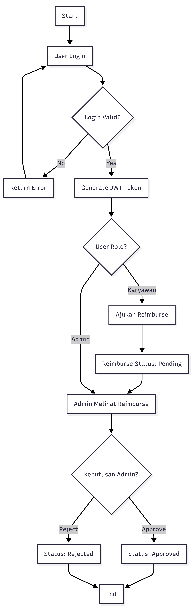

# Reimburse App

A simple reimbursement management system that helps employees submit reimbursement requests digitally while allowing administrators to review, approve, or reject requests efficiently.

## Problem

Many small businesses still manage employee reimbursements manually using chat applications or spreadsheets. This often leads to:

- Lost or scattered reimbursement records
- Slow approval process
- Difficulty tracking reimbursement status
- Lack of centralized reimbursement history

This application digitizes the reimbursement workflow into a simple web-based system with authentication and role-based access.

## Live Demo

🌐 https://reimburse-app.tansys.my.id/

## Tech Stack

- **Backend:** Laravel 11
- **Authentication:** JWT (tymon/jwt-auth)
- **Frontend:** Vanilla JavaScript & Bootstrap 5
- **Database:** MySQL

## Features

### Authentication
- JWT-based authentication
- Secure login system
- Role-based authorization

### Employee
- Login to the system
- Submit reimbursement requests
- View reimbursement history
- Track reimbursement status

### Admin
- View all reimbursement requests
- Review reimbursement details
- Approve or reject requests
- Manage reimbursement workflow

## Reimbursement Status

- **Pending** – Waiting for admin review
- **Paid** – Approved and paid
- **Rejected** – Request rejected

## Database Structure

| Table | Description |
|-------|-------------|
| users | User accounts and roles |
| reimburse_requests | Employee reimbursement submissions |
| reimburse_approvals | Approval records made by administrators |

## Application Flow

1. User logs in using JWT authentication.
2. Employee submits a reimbursement request.
3. Request is stored with **Pending** status.
4. Admin reviews the request.
5. Admin approves or rejects it.
6. System updates the reimbursement status.

## API Endpoints

| Method | Endpoint | Description |
|--------|----------|-------------|
| POST | `/api/login` | User authentication |
| POST | `/api/reimburse` | Create reimbursement request |
| GET | `/api/reimburse` | Retrieve reimbursement requests |
| POST | `/api/reimburse/{id}/approve` | Approve or reject reimbursement |

## Getting Started

### Backend

```bash
git clone <repository-url>

cd backend

composer install

cp .env.example .env

php artisan key:generate

php artisan migrate

php artisan jwt:secret

php artisan serve
```

### Frontend

The frontend is built with **Vanilla JavaScript** and **Bootstrap 5**.

Simply open it using:

- Live Server (recommended)
- Any static web server
- Or access the deployed demo above

## Project Structure

```
backend/
frontend/
docs/
```

## Notes

- Built with a minimalist architecture
- Uses JWT Authentication
- No frontend framework
- No refresh token implementation
- Designed as a simple learning and portfolio project

## Flowchart

